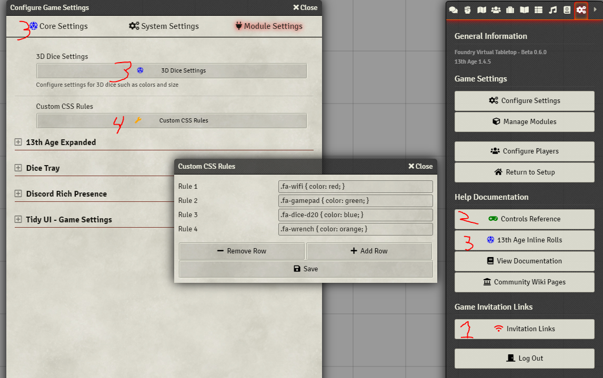

[](https://github.com/cswendrowski/foundryget)
[](https://www.buymeacoffee.com/T2tZvWJ)


# Custom CSS Rules

Allows a user to setup custom CSS rules in a world



## What problem does this solve?

When adding a lot of modules, every now and then they don't quite agree with each other on where things should live. A small amount of CSS can fix this, but manually patching CSS in the server or writing a local module is a pain. This module allows you to quickly and easily enter per-world CSS rules to make these tweaks instead.


# Installation

Using [FoundryGet](https://github.com/cswendrowski/foundryget)

```
foundryget install https://raw.githubusercontent.com/cswendrowski/FoundryVTT-Custom-CSS/master/module.json
```
